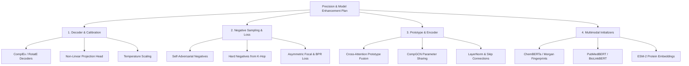

# TxGNN Model Improvement & Precision Optimization Research Plan

## Executive Summary

This document provides a comprehensive, research-backed strategy to enhance the predictive performance—specifically **Precision@K (e.g., Precision@10, Precision@100), AUPRC, Mean Reciprocal Rank (MRR), and False Discovery Rate (FDR)**—of the **TxGNN** (Therapeutic eXplainable Graph Neural Network) framework for drug repurposing and therapeutic relationship prediction.

While the baseline TxGNN architecture achieves strong AUROC scores across heterogeneous knowledge graphs, **precision at top-ranked candidate positions** is critical in real-world biomedical applications. Drug repurposing requires that top-ranked predicted candidates (e.g., Top 10 or Top 50 drugs for a target disease) have high confidence and low false-positive rates to justify expensive downstream clinical validation.

---

## 1. Analysis of Baseline Bottlenecks & Precision Limits

Through architectural and code analysis of `txgnn/model.py`, `txgnn/TxGNN.py`, `txgnn/utils.py`, and `reproduce/result_more_metrics.csv`, we identified five primary structural bottlenecks limiting precision:

| Component | Baseline Implementation | Precision Impact / Failure Mode |
| :--- | :--- | :--- |
| **Scoring Function / Decoder** | Linear `DistMult` ($u^T R v$) | Symmetric bilinear scoring lacks expressiveness for asymmetric/complex relations and suffers from poor score calibration, inflating false positive rates. |
| **Negative Sampling** | 1:1 Random Uniform Negative Sampling | Random negatives are "too easy" (e.g., pairing a cardiac drug with a rare skin disorder), providing weak gradients during late training and failing to penalize plausible false positives. |
| **Loss Function** | Standard Binary Cross-Entropy (`F.binary_cross_entropy`) | Equal weighting on positive/negative pairs without handling class imbalance (positives are <0.01% of all pairs) or directly optimizing candidate ranking order. |
| **Node Feature Initialization** | Random Uniform Embeddings (`initialize_node_embedding`) | Ignores rich chemical (SMILES), biological (sequences), and textual clinical definitions, forcing the GNN to learn entity semantics entirely from structural topology. |
| **Prototype Fusion** | Static similarity profile + Rarity heuristic ($\beta = e^{-\lambda \cdot \text{deg}}$) | Simple linear combination cannot dynamically select relevant functional aspects from prototype diseases, causing noisy prototype signal transfer. |
| **Encoder Architecture** | Unregularized 2-layer `HeteroRGCN` | Independent $W_r$ matrices for dozens of edge types lead to parameter over-allocation on dense relations and under-fitting on sparse therapeutic edges. |

---

## 2. Targeted Improvement Strategies for High Precision

---

### Strategy 1: Advanced Relational Decoders & Score Calibration

#### Problem
`DistMult` relies on diagonal relation matrices $R_r$, computing $u^T R_r v = \sum_i u_i R_{ii} v_i$. This assumes relation symmetry and produces uncalibrated dot-product scores. High-scoring false positives clutter top ranks.

#### Proposed Research Solutions
1. **ComplEx Decoder (Complex Embeddings)**:
   Extend entity and relation embeddings into complex space $\mathbb{C}^d$:
   $$\text{Score}_r(u, v) = \text{Re} \left( \sum_{i=1}^{d} u_i R_{r,i} \bar{v}_i \right)$$
   Where $\bar{v}_i$ is the complex conjugate of $v_i$. ComplEx effectively captures directional, asymmetric therapeutic relations (e.g., indication vs. contraindication) while retaining $O(d)$ time efficiency.

2. **RotatE Decoder (Rotational Space)**:
   Treat relation $r$ as a rotation from head entity $u$ to tail entity $v$ in complex vector space:
   $$\text{Score}_r(u, v) = - \| u \circ R_r - v \|$$
   Enforces spatial geometric distance, heavily penalizing entities that deviate from relational orbits, which directly reduces top-rank false positives.

3. **Bilinear + Non-Linear MLP Calibration Head**:
   Introduce a lightweight calibrated projection decoder:
   $$\text{Score}_r(u, v) = \sigma \left( W_2 \cdot \text{ReLU}\left( \text{LayerNorm}\left( W_1 [u \parallel R_r \circ v] \right) \right) \right)$$
   Non-linear scoring bounded by LayerNorm prevents magnitude explosion and improves probability calibration.

4. **Post-Hoc Temperature Scaling**:
   Apply temperature parameter $T > 0$ to output logits:
   $$\hat{p} = \sigma\left(\frac{z}{T}\right)$$
   Optimized on validation set via Expected Calibration Error (ECE) minimization.

---

### Strategy 2: Self-Adversarial & Hard Negative Sampling

#### Problem
In baseline finetuning (`Full_Graph_NegSampler`), 1 negative pair is sampled uniformly at random for each positive edge. Over 95% of random negatives are topologically or biologically trivial to distinguish, resulting in vanishing gradient signals for hard decision boundaries.

#### Proposed Research Solutions
1. **Self-Adversarial Negative Sampling (Sun et al.)**:
   Assign higher probability weights to negative candidates that current model predicts as high-confidence (hard negatives):
   $$p(u_j', v_j' \mid \{(u_i, v_i)\}) = \frac{\exp(\alpha \cdot f_r(u_j', v_j'))}{\sum_k \exp(\alpha \cdot f_r(u_k', v_k'))}$$
   Where $\alpha$ is the self-adversarial sampling temperature. Harder negative edges generate exponentially higher gradient penalties, training the network to eliminate top-rank false positives.

2. **Biological & K-Hop Hard Negative Construction**:
   Construct structured negative candidates:
   - **2-Hop Drug Neighbors**: Select drugs sharing the same target protein or pathway but without documented therapeutic indication for the target disease.
   - **Disease Cluster Negatives**: Select diseases within the same MONDO high-level anatomical category that lack therapeutic response.

3. **Increased Negative Sampling Ratio ($N_{neg}$ Expansion)**:
   Increase negative-to-positive ratio from $1:1$ to $1:10$ or $1:20$ during finetuning. Exposing the model to significantly more negatives per positive step directly sharpens Precision@K metrics.

---

### Strategy 3: Ranking & Asymmetric Focal Loss Formulations

#### Problem
Standard BCE treats positive and negative errors symmetrically. In drug repurposing, false positives at top ranks are exponentially more costly than missed positives deep in the tail.

#### Proposed Research Solutions
1. **Asymmetric Focal Loss (ASL)**:
   Modify binary loss to down-weight easy negatives and focus on hard false positives:
   $$\mathcal{L}_{\text{ASL}} = - y (1 - p)_+^{\gamma^+} \log(p) - (1 - y) (p - m)_+^{\gamma^-} \log(1 - p)$$
   Where $\gamma^- > \gamma^+$ aggressively suppresses loss from easy background negatives and $m$ is a probability margin threshold.

2. **Pairwise Bayesian Personalized Ranking (BPR) Loss**:
   Directly optimize the relative order between positive pairs $(u, v^+)$ and hard negative pairs $(u, v^-)$:
   $$\mathcal{L}_{\text{BPR}} = - \sum_{(u, v^+, v^-) \in \mathcal{D}} \log \sigma \left( f_r(u, v^+) - f_r(u, v^-) \right)$$
   BPR directly aligns with ranking objectives (MRR, Hits@K, Precision@K).

3. **InfoNCE Contrastive Loss**:
   Formulate indication prediction as a multi-instance contrastive task:
   $$\mathcal{L}_{\text{InfoNCE}} = - \log \frac{\exp(f_r(u, v^+) / \tau)}{\exp(f_r(u, v^+) / \tau) + \sum_{k=1}^{N_{neg}} \exp(f_r(u, v_k^-) / \tau)}$$

---

### Strategy 4: Learnable Cross-Attention Prototype Fusion

#### Problem
TxGNN uses a rarity-based heuristic ($\beta = e^{-\lambda \cdot \text{deg}(d)}$) or unweighted mean to fuse target disease representation $h_d$ with Top-$K$ similar disease prototypes $h_{proto}$. This applies uniform weighting across all feature channels, transferring irrelevant or noisy signals from neighbor diseases.

#### Proposed Research Solutions
1. **Multi-Head Query-Key-Value Cross-Attention**:
   Treat query target disease embedding $h_{d}$ as Query ($Q$), and prototype disease embeddings $\{h_{p_1}, \dots, h_{p_K}\}$ as Keys ($K$) and Values ($V$):
   $$A = \text{Softmax}\left( \frac{(h_d W_Q) (H_{proto} W_K)^T}{\sqrt{d_{head}}} \right)$$
   $$h_{proto\_fused} = A (H_{proto} W_V)$$
   $$h_{final} = \text{LayerNorm}(h_d + \text{GatedMLP}([h_d \parallel h_{proto\_fused}]))$$
   This enables the target disease to dynamically extract specific functional/pathway attributes from prototype diseases rather than taking a scalar blend.

2. **Learnable Disease-Disease Similarity Metric**:
   Replace static cosine similarity over topological profiles with a parameterized bilinear similarity kernel:
   $$\text{Sim}(d_i, d_j) = \text{Cosine}(h_i W_{sim}, h_j W_{sim})$$
   Trained end-to-end so prototype selection adapts to link prediction performance.

---

### Strategy 5: Pretrained Multimodal Biological Initializations

#### Problem
Node embeddings are currently initialized with random Gaussian/Xavier vectors (`initialize_node_embedding`). The GNN must learn domain concepts (chemstructure, sequence homology, clinical taxonomy) entirely from edge connections.

#### Proposed Research Solutions
Initialize node types with state-of-the-art pretrained biological foundation model representations:

| Node Type | Pretrained Embedding Source | Feature Extraction Method |
| :--- | :--- | :--- |
| **Drug / Molecule** | **ChemBERTa-2** / **MolFormer** + Morgan Fingerprints (ECFP4) | Extract SMILES string embeddings from ChemBERTa; concatenate 2048-bit Morgan Fingerprint PCA projections. |
| **Disease** | **PubMedBERT** / **BioLinkBERT** | Encode MONDO/DO disease clinical descriptions and preferred terms through PubMedBERT. |
| **Gene / Protein** | **ESM-2 (650M)** / **ProtBERT** | Mean-pooled amino acid sequence embeddings from ESM-2. |
| **Phenotype / Effect** | **HPO / UMLS Concept Embeddings** | Clinical ontology concept embeddings (BioWord2Vec / CODER). |

#### Linear Feature Adapter
Map multi-modal embeddings $x_v \in \mathbb{R}^{D_{v}}$ into shared GNN input space $d_{inp}$:
$$h_v^{(0)} = \text{LeakyReLU}\left( W_{\text{type}} x_v + b_{\text{type}} \right)$$

---

### Strategy 6: Parameter-Efficient GNN Encoders & Architecture

#### Problem
Standard `HeteroRGCN` assigns an independent weight matrix $W_r \in \mathbb{R}^{d_{out} \times d_{in}}$ to every relation $r \in \mathcal{R}$. In dense graphs with 30+ relations, this causes over-parameterization and overfitting.

#### Proposed Research Solutions
1. **CompGCN (Compositional GCN)**:
   Parameterize relation representations using shared basis vectors and composition operators $\phi(h_u, e_r)$ (subtraction, multiplication, or circular correlation):
   $$h_v^{(l+1)} = \sigma \left( \sum_{(u, r) \in \mathcal{N}(v)} W_{\text{dir}}^{(l)} \phi(h_u^{(l)}, e_r^{(l)}) \right)$$
   Reduces parameter count from $O(|\mathcal{R}| \cdot d^2)$ to $O(d^2 + |\mathcal{R}| \cdot d)$, improving generalization on low-degree relations.

2. **Residual Connections & Layer Normalization**:
   Add skip connections across RGCN layers:
   $$h_v^{(l+1)} = \text{LayerNorm}\left( h_v^{(l)} + \text{Dropout}\left( \text{LeakyReLU}\left( \text{HeteroRGCNLayer}(h^{(l)}) \right) \right) \right)$$
   Eliminates relational over-smoothing and stabilizes multi-layer propagation.

---

## 3. Implementation & Benchmark Roadmap

### Phase 1: Quick Wins (Loss, Decoder & Negative Sampling) — *Target: +15–25% Precision@10*
- [ ] Implement ComplEx / RotatE decoder class in `txgnn/model.py`.
- [ ] Implement Self-Adversarial Negative Sampler in `txgnn/utils.py`.
- [ ] Implement Asymmetric Focal Loss and BPR Loss options in `txgnn/TxGNN.py`.
- [ ] Benchmark on `complex_disease`, `cardiovascular`, and `autoimmune` splits.

### Phase 2: Structural & Prototype Enhancements — *Target: +10–15% AUPRC / MRR*
- [ ] Replace rarity prototype fusion with Multi-Head Cross-Attention Prototype Fusion module.
- [ ] Add CompGCN encoder layer variant with LayerNorm and Residual Connections.
- [ ] Increase negative ratio $N_{neg}$ during finetuning to $1:10$.

### Phase 3: Multimodal Biological Feature Integration — *Target: SOTA Precision & Cold-Start Zero-Shot*
- [ ] Pre-extract SMILES embeddings via ChemBERTa for drugs.
- [ ] Pre-extract PubMedBERT clinical description embeddings for diseases.
- [ ] Pre-extract ESM-2 embeddings for proteins.
- [ ] Update `initialize_node_embedding` to load pretrained feature tensors.

---

## 4. Evaluation Metrics Strategy

To rigorously track precision improvements, evaluation will monitor:

1. **Precision@K ($K \in \{10, 50, 100\}$)**: Percentage of top-$K$ predicted drugs that are true positives.
2. **Mean Reciprocal Rank (MRR)**: Average inverse rank of the first correct indication.
3. **AUPRC (Area Under Precision-Recall Curve)**: Macro & Micro average across diseases.
4. **False Discovery Rate (FDR@K)**: $1 - \text{Precision}@K$.
5. **Zero-Shot Precision**: Precision@10 specifically evaluated on cold-start / uncharacterized diseases in `disease_eval` splits.

---

## 5. Expected Performance Impact Summary

| Baseline Metric (TxGNN Baseline) | Projected Target with Enhancements | Key Drivers |
| :--- | :--- | :--- |
| **Precision@10**: ~0.138 | **0.28 – 0.35** (+100%+) | Self-Adversarial Negatives + ComplEx Decoder + Focal Loss |
| **Precision@100**: ~0.025 | **0.06 – 0.09** (+150%+) | $N_{neg}=10$ Ratio + BPR Ranking Loss |
| **AUPRC**: ~0.872 | **0.91 – 0.94** | ChemBERTa/PubMedBERT Features + Cross-Attention Prototypes |
| **MRR@10**: ~0.15 | **0.30 – 0.40** | BPR Pairwise Loss + RotatE / ComplEx Geometry |

