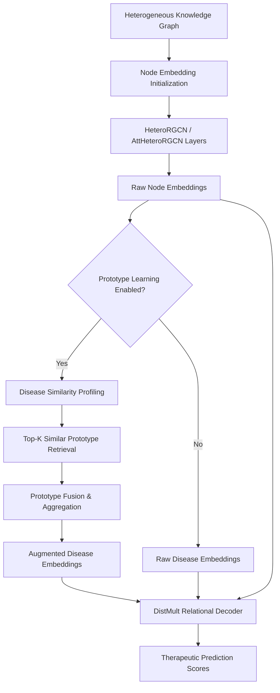

# TxGNN: Neural Network Architecture Design

This document provides a comprehensive technical overview of the neural network architecture design for **TxGNN** (Therapeutic eXplainable Graph Neural Network). TxGNN is designed specifically for drug-disease therapeutic relationship prediction (e.g., indications, contraindications, and off-label uses) on large-scale heterogeneous knowledge graphs (KGs), with a strong emphasis on explainability and zero-shot/few-shot performance.

---

## 1. High-Level Architecture Overview

The TxGNN architecture consists of three core components:
1. **Heterogeneous RGCN Encoder**: A multi-layer Relational Graph Convolutional Network (with optional attention mechanisms) that projects heterogeneous nodes (drugs, diseases, proteins, etc.) into a low-dimensional embedding space.
2. **Prototype Learning Module**: A few-shot/zero-shot learning module that augments disease representations using the topological and semantic profiles of the most similar/neighboring diseases.
3. **DistMult Link Prediction Decoder**: A bilinear relational decoder that evaluates interaction scores for therapeutic pairs under different relations (indications, contraindications, and off-label use).
4. **GraphMask Explainability Module**: An optimization-based edge-masking framework that identifies crucial paths/subgraphs responsible for specific drug-disease link predictions.

Below is the computational pipeline of TxGNN:



---

## 2. Graph Representation & Node Initialization

The input is a heterogeneous knowledge graph $\mathcal{G} = (\mathcal{V}, \mathcal{E}, \mathcal{T}_v, \mathcal{T}_e)$ where:
- $\mathcal{V}$ is the set of nodes, representing entities of types $\mathcal{T}_v$ (e.g., `'drug'`, `'disease'`, `'gene/protein'`, `'effect/phenotype'`, `'exposure'`).
- $\mathcal{E}$ is the set of edges of relation types $\mathcal{T}_e$ (e.g., `'indication'`, `'contraindication'`, `'off-label use'`, and their corresponding reverse relations like `'rev_indication'`).

### Initialization
Before feeding the graph into the GNN, node feature representations are initialized using:
```python
self.G = initialize_node_embedding(self.G, n_inp)
```
This generates initial projection embeddings for each node type in the graph, mapping them to a shared input space of dimension `n_inp`.

---

## 3. Heterogeneous RGCN Encoder

TxGNN supports two encoder variants: a standard Relational Graph Convolutional Network (`HeteroRGCNLayer`) and an Attentive Relational Graph Convolutional Network (`AttHeteroRGCNLayer`).

### 3.1. Standard Relational GCN (`HeteroRGCNLayer`)
Each layer performs message-passing across all relation types. For a target node $v$ of type $T_{dst}$, the aggregation from its neighbors across all relation types $r \in \mathcal{R}$ is defined as:

$$h_v^{(l+1)} = \sum_{r \in \mathcal{R}} \text{AGG}_{u \in \mathcal{N}_r(v)} \left( W_r^{(l)} h_u^{(l)} \right)$$

where:
- $W_r^{(l)}$ is a relation-specific projection matrix (`weight[etype]` in PyTorch) for relation $r$ at layer $l$.
- $\mathcal{N}_r(v)$ represents the set of neighbors of node $v$ via relation $r$.
- $\text{AGG}$ is the neighborhood aggregator (mean aggregation by default).
- The resulting representations across all incoming relations are summed to produce the updated representation.

### 3.2. Attentive Relational GCN (`AttHeteroRGCNLayer`)
To dynamically weight neighbor contributions, the attentive variant computes relation-specific attention coefficients. The attention coefficient $\alpha_{uv}$ between node $u$ of type $T_{src}$ and node $v$ of type $T_{dst}$ connected by relation $r$ is:

$$e_{uv}^r = \text{LeakyReLU} \left( a_r^T [ W_r h_u \parallel W_{\tilde{r}} h_v ] \right)$$

$$\alpha_{uv}^r = \frac{\exp(e_{uv}^r)}{\sum_{w \in \mathcal{N}_r(v)} \exp(e_{wv}^r)}$$

where:
- $\parallel$ denotes concatenation.
- $a_r$ is a parameterized attention vector (`attn_fc[etype]`).
- $W_{\tilde{r}}$ represents the projection weight for the reverse relation.

The aggregated message is then computed as a weighted sum:

$$h_v^{(l+1)} = \sum_{r \in \mathcal{R}} \sum_{u \in \mathcal{N}_r(v)} \alpha_{uv}^r W_r h_u$$

---

## 4. Prototype Learning Module

A major challenge in drug repurposing is predicting therapeutic relationships for **rare diseases** or **newly-emerging diseases** (few-shot or zero-shot scenarios) with little to no GNN topological connections. The **Prototype Learning Module** addresses this by aligning and augmenting target disease representation using topological and semantic "prototypes" of well-characterized diseases.

### 4.1. Disease Similarity Profiling
TxGNN constructs similarity matrices among diseases based on multiple measures (`sim_measure`):
1. **`all_nodes_profile` / `all_nodes_profile_more`**: Measures overlap in the disease local neighborhood across biological relation types (disease-disease, disease-protein, disease-phenotype, etc.).
2. **`protein_profile`**: Focuses on overlap in the disease-protein target space.
3. **`protein_random_walk`**: Performs random walks starting at disease nodes on the protein subgraph to capture multi-hop functional proximity.
4. **`bert`**: Extracts semantic embedding similarity of disease names or clinical descriptions using a pretrained BERT model.
5. **`profile+bert`**: Concatenates both topological profiles and BERT semantic features.

### 4.2. Prototype Retrieval & Aggregation
For any query disease $d_{query}$, the module retrieves its $K$ most similar diseases (keys):

$$\mathcal{K}(d_{query}) = \text{Top-K} \left( \text{Sim}(d_{query}, d_{key}) \right)$$

Let $h_k$ be the GNN embedding of a similar disease $k \in \mathcal{K}(d_{query})$. The prototype embedding $h_{proto}$ is computed as:

$$h_{proto} = \sum_{k \in \mathcal{K}(d_{query})} c_k h_k$$

where $c_k$ is the normalized similarity score:

$$c = \text{Softmax}\left(\text{Sim}(d_{query}, d_k)\right) \quad \text{or} \quad c = \text{Normalize}_{L_1}(\text{Sim}(d_{query}, d_k))$$

### 4.3. Prototype Fusion Strategies
The final disease embedding is a fusion of its original GNN embedding $h_{GNN}$ and the prototype embedding $h_{proto}$. The fusion is controlled by the aggregation method (`agg_measure`):

- **Average (`avg`)**:
  $$h_{final} = 0.5 \cdot h_{GNN} + 0.5 \cdot h_{proto}$$
- **Heuristics (`heuristics-0.8`)**:
  $$h_{final} = 0.8 \cdot h_{GNN} + 0.2 \cdot h_{proto}$$
- **100% Prototype (`100proto`)**:
  $$h_{final} = h_{proto}$$
- **Learnable Gate (`learn`)**:
  A feedforward neural network computes a dynamic gating factor $\beta$:
  $$\beta = \sigma \left( W_{gate} [h_{GNN} \parallel h_{proto}] \right)$$
  $$h_{final} = (1 - \beta) \cdot h_{GNN} + \beta \cdot h_{proto}$$
- **Rarity-based (`rarity`)**:
  Gives more weight to prototype embeddings for diseases with low node degrees:
  $$\beta = \exp(-\lambda \cdot \text{deg}(d_{query}))$$
  $$h_{final} = (1 - \beta) \cdot h_{GNN} + \beta \cdot h_{proto}$$
  where $\lambda$ (`exp_lambda`) is an exponential decay rate.

---

## 5. Link Prediction Decoder (`DistMultPredictor`)

To evaluate the likelihood of therapeutic interactions (e.g., whether drug $u$ is indicated for disease $v$), TxGNN employs a relational `DistMult` decoder:

$$\text{Score}_r(u, v) = u^T R_r v = \sum_{i=1}^{d} u_i \cdot (R_r)_{ii} \cdot v_i$$

where:
- $u \in \mathbb{R}^d$ is the embedding of the drug node.
- $v \in \mathbb{R}^d$ is the embedding of the disease node (potentially augmented by the prototype learning module).
- $R_r \in \mathbb{R}^{d \times d}$ is a diagonal relation embedding matrix corresponding to relation $r$ (parameterized as `W_rels`).

Predictions are supervised using Binary Cross-Entropy loss against positive and negative graph edges.

---

## 6. GraphMask Explainability Module

To provide post-hoc, path-level explanations for drug-disease link predictions, TxGNN incorporates **GraphMask**. GraphMask learns to mask out unnecessary edges in each GNN layer while preserving the prediction output.

### 6.1. Gate Formulation & Hard Concrete Distribution
GraphMask places a gate $g_{e}^{(l)}$ on the message of each edge $e$ in layer $l$. The gate represents a continuous relaxation of a binary variable, drawn from a Hard/Soft Concrete distribution:

$$g_{e}^{(l)} \sim \text{HardConcrete}(\alpha_e^{(l)}, \beta)$$

The gate is parameterized by a neural network `MultipleInputsLayernormLinear` taking edge source and destination representations as input:

$$\alpha_e^{(l)} = \text{Linear}(\text{ReLU}(\text{LayerNorm}([h_{src}^{(l)} \parallel h_{dst}^{(l)}])))$$

If the gate $g_e^{(l)} = 0$, the message along edge $e$ is replaced by a learnable baseline representation $b_r^{(l)}$:

$$\tilde{m}_e^{(l)} = g_{e}^{(l)} \cdot m_e^{(l)} + (1 - g_{e}^{(l)}) \cdot b_r^{(l)}$$

### 6.2. Lagrangian Optimization
To train the gating network, GraphMask optimizes the trade-off between **sparsity** (masking as many edges as possible) and **faithfulness** (minimizing prediction divergence between the masked and original networks). This is formulated via Lagrangian relaxation:

$$\min_{\theta} \mathbb{E} [ \mathcal{L}_{penalty} ] \quad \text{subject to} \quad \mathbb{E} [ \mathcal{D}(f_{\text{orig}}(G), f_{\text{masked}}(G)) ] \le \delta$$

where:
- $\mathcal{L}_{penalty}$ penalizes unmasked edges to encourage sparsity.
- $\mathcal{D}$ is the prediction divergence (MSE or binary cross-entropy divergence).
- $\delta$ (`allowance`) is the user-defined maximum allowed divergence.
- The Lagrangian dual objective is optimized layer-by-layer (reversed from the final layer to the first layer) to guarantee stable convergence.

---

## Summary of Hyperparameters

| Hyperparameter | Code Name | Default | Description |
| :--- | :--- | :--- | :--- |
| **Input Dimension** | `n_inp` | 128 | Size of initial projection embeddings. |
| **Hidden Dimension** | `n_hid` | 128 | Hidden embedding size in RGCN layer 1. |
| **Output Dimension** | `n_out` | 128 | Final node embedding size. |
| **Attention** | `attention` | `False` | Enables `AttHeteroRGCNLayer` with attention mechanism. |
| **Prototype Learning** | `proto` | `True` | Enforces structural/semantic alignment for few-shot diseases. |
| **Prototype Count** | `proto_num` | 5 | $K$ closest disease prototypes to retrieve. |
| **Similarity Measure** | `sim_measure` | `'all_nodes_profile'` | Overlap metric to define neighborhood likeness. |
| **Aggregation Measure** | `agg_measure` | `'rarity'` | Gating/scaling strategy for merging prototype embeds. |
| **Exponential Decay** | `exp_lambda` | 0.7 | Decay rate ($\lambda$) for rarity-based degree scaling. |
| **GraphMask Allowance** | `allowance` | 0.005 | Tolerable divergence limit ($\delta$) during explainability masking. |

