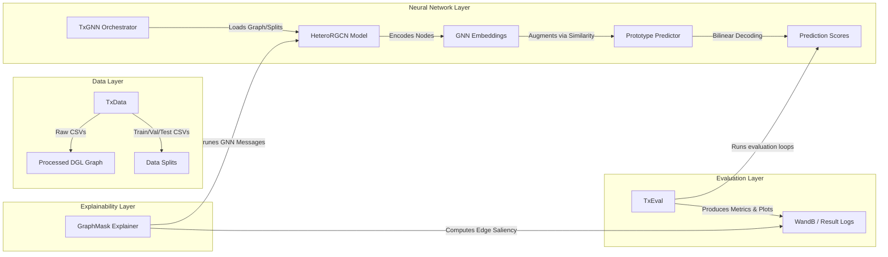

# TxGNN: System Architecture & Data Flow Design

This document details the system design of the **TxGNN** package. It explains the software architecture, modular structure, data ingestion, pipeline workflows, and interaction between different classes of the framework.

---

## 1. High-Level Modular Design

TxGNN is structured into clean, decoupled Python modules under the `txgnn` package directory:

```
txgnn/
├── __init__.py           # Package exports
├── TxData.py             # Data ingestion, preprocessing, and dataset splitting
├── model.py              # Neural network components (GNN encoder, predictor, decoder)
├── TxGNN.py              # Training wrapper, model loading/saving, pipeline orchestrator
├── TxEval.py             # Performance evaluation wrapper (disease-centric metrics, plot helper)
├── utils.py              # Math, graph utilities, negative samplers, metrics
└── graphmask/            # GraphMask explainability subgraph extraction modules
```

The diagram below illustrates the system-level interactions:



---

## 2. Core Module Implementations

### 2.1. Ingestion & Preprocessing (`TxData`)
- **Responsibility**: Bootstrapping files (`kg.csv`, `node.csv`, `edges.csv`), preprocesses directed links, and partitions relationships.
- **Workflow**:
  1. Downloads required artifacts via `data_download_wrapper` if missing.
  2. Runs `preprocess_kg()` to format undirected graphs to directed edges with appropriate type mapping (`x_idx`, `y_idx`, `relation`).
  3. Supports multiple partition splits via `prepare_split()`:
     - `random` (typical random edges split)
     - `complex_disease` (evaluation designed for disease areas)
     - `disease_eval` (single target disease area)
     - Custom clinical categories (e.g. `cardiovascular`, `autoimmune`, `mental_health`).
  4. Caches partitions to disk (`train.csv`, `valid.csv`, `test.csv`) inside directory sub-folders for reproducible executions.

### 2.2. GNN Encoder & Link Predictor (`model.py`)
- **Responsibility**: Realizes the model layers, prototype alignment, and decoder scoring.
- **Components**:
  - `HeteroRGCN`: Composes multiple layers, decodes relational scores, and coordinates the forward paths (both standard and GraphMask explainability passes).
  - `HeteroRGCNLayer`: Message passing implementation using DGL API. Multi-relation incoming feature projection and aggregation.
  - `AttHeteroRGCNLayer`: Node-attention implementation on bipartite structures.
  - `DistMultPredictor`: Evaluates the bilinear scoring function. Integrates prototype neighbor discovery for out-of-distribution or zero-shot disease domains.

### 2.3. Pipeline Orchestrator (`TxGNN.py`)
- **Responsibility**: Training loops, wandb telemetry tracking, state serialization (`save_model` / `load_pretrained`).
- **Core Functions**:
  - `pretrain()`: Minibatch-based link prediction training across all KG relation types via negative samplers (`Minibatch_NegSampler`).
  - `finetune()`: Focuses exclusively on therapeutic links (drug-disease interactions) using full-batch optimization (`Full_Graph_NegSampler`).
  - `train_graphmask()`: Optimizes edge gates for post-hoc explanation validation.

### 2.4. Evaluation Suite (`TxEval.py`)
- **Responsibility**: Computes test metrics tailored for therapeutic targets.
- **Workflow**:
  - Performs **disease-centric evaluation** via `eval_disease_centric()`, computing:
    - Micro/Macro AUROC & AUPRC performance metrics.
    - Performance under stratified degrees of drug interactions.
  - Simulates random drug predictions for benchmarking.

---

## 3. Data Integration & Workflow Pipeline

The step-by-step model engineering process is outlined below:

### Phase 1: Data Preparation
```python
from txgnn import TxData, TxGNN, TxEval

# 1. Initialize data layer & compute dataset splits
data = TxData(data_folder_path='./data')
data.prepare_split(split='complex_disease', seed=42)
```

### Phase 2: Model Instantiation & Training
```python
# 2. Setup training wrapper
txgnn_pipeline = TxGNN(data, weight_bias_track=True, proj_name='TxGNN_Study')

# 3. Initialize layers with prototyping alignment
txgnn_pipeline.model_initialize(n_inp=128, n_hid=128, proto=True, proto_num=5)

# 4. Optional Pretraining (on whole KG) and Finetuning (on drug-disease links)
txgnn_pipeline.pretrain(n_epoch=2)
txgnn_pipeline.finetune(n_epoch=100)

# 5. Persist the state
txgnn_pipeline.save_model('./saved_models/txgnn_disease_model')
```

### Phase 3: Explainability Attribution
```python
# 6. Execute GraphMask to find explanation paths
txgnn_pipeline.train_graphmask(relation='indication', epochs_per_layer=500)
txgnn_pipeline.retrieve_save_gates('./explanations/')
```

---

## 4. Key Design Patterns & Engineering Highlights

1. **Local Graph Scope Operations**: To prevent memory leaks and graph mutation issues during execution, deep message-passing operates in local namespaces using DGL's `with graph.local_scope():` context manager.
2. **Dynamic Lazy Prototyping**: Similarity vectors for unseen diseases in test sets are generated lazily during validation/testing instead of precomputing static representations. This allows seamless inference on cold-start graph entities.
3. **Decoupled Architecture and Explanation**: The GNN weights remain frozen during GraphMask training. Only the gate variables (`gates_all`) and replacement baselines (`baselines_all`) have active gradients, protecting the predictive power of the model.
4. **Efficient Negative Samplers**: Memory-efficient sampling classes (`Minibatch_NegSampler`, `Full_Graph_NegSampler`) filter target relation pairs to generate robust negative training pairs.
